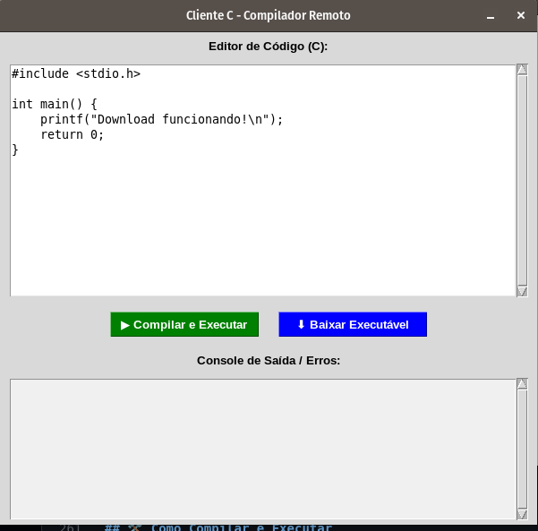

# Trabalho de labratório de Sistemas distribuídos: Sockets em Linux

Este repositório contém a resolução do trabalho da disciplina de Sistemas distribuídos, focado na implementação de um servidor de sockets em C capaz de lidar com múltiplas conexões e executar um serviço de compilação remota.


## Descrição do Trabalho

* O objetivo deste trabalho é evoluir um servidor de socket TCP básico, que inicialmente só atende um cliente por vez, para uma aplicação robusta capaz de gerenciar múltiplas requisições de clientes de forma concorrente.

* O projeto final consiste em um **servidor de compilação** e um **cliente com interface gráfica (GUI)** para interagir com este serviço.

---

## 🚀 Questões Propostas

Abaixo estão as questões do trabalho e as seções para as respostas e implementações correspondentes.

### Questão 1: Soluções para Múltiplos Clientes

> Quais as soluções possíveis para que o programa servidor possa atender a uma quantidade indeterminada de requisições de programas clientes? 

#### Resposta

Conforme [M. 2008 pp. 36, 68, 121–122], uma das mais simples técnicas para implementar um servidor concorrente é por meio de funções fork do unix, que é capaz de criar processo-filho para atender múltiplos clientes ao mesmo tempo. Para isso, o servidor aceita conexões clientes e bifurca a requisição com a chamada da função fork para criar uma cópia de si próprio (Figura 2.13), deixando o processo-filho atender a requisição do cliente. Dessa forma o processo-pai espera novas conexões e cria novos processos-filho a cada nova requisição(Figura 2.14). Assim, é capaz de atender a uma quantidade indeterminada de requisições de programas clientes.

 
 


Na prática, conforme a imagem abaixo, o processo servidor (Pai) opera em um loop infinito, aguardando conexões bloqueado na chamada accept. Quando uma conexão é estabelecida, o servidor cria um processo-filho via fork(). O processo Pai imediatamente fecha sua cópia do socket conectado e volta a esperar por novas conexões em accept. O processo Filho, por sua vez, fecha o socket de escuta (pois não o usará), processa toda a comunicação com o cliente através do socket conectado e, ao finalizar, fecha o socket conectado e termina sua execução.


Além da abordagem baseada em **processos**, outra solução utilizada para lidar com múltiplos clientes é o uso de **threads**, especialmente através de um **pool de threads**. Essa estratégia resolve problemas de custo e eficiência apresentados na técnica que cria um processo-filho por cliente.

> “A bifurcação (fork) é cara. A memória é copiada do pai para o filho […] e mesmo com otimizações como copy-on-write, a operação continua sendo pesada.”  
> — Stevens et al., 2008

> “É exigido um IPC para passar as informações entre o pai e o filho […]. Retornar informações do filho para o pai dá mais trabalho.”  

As threads são bem mais leves e compartilharem a mesma memória global, o que facilita comunicação entre elas (embora introduza a necessidade de sincronização).

Além disso, conforme o próprio Stevens destaca:

> “É mais rápido pré-bifurcar um pool de filhos do que criar um filho para cada cliente. Em um sistema que suporta threads, é razoável esperar um aumento de velocidade semelhante, por meio da criação de um pool de threads quando o servidor inicia, em vez de criar um novo thread para cada cliente.”

> “O projeto básico desse servidor é criar um pool de threads e então deixar cada thread chamar `accept`. Em vez de ter cada thread bloqueada na chamada de `accept`, utilizaremos um bloqueio de mutex que permite que somente um thread por vez chame `accept`.”

Essa é exatamente a lógica implementada na solução usando pool de threads.

**✔ Como funciona a Solução baseada em Pool de Threads**

1. **Inicialização**
   - Cria socket TCP, `bind()` e `listen()`.
   - Cria um pool fixo de threads (`THREAD_POOL_SIZE`) ao iniciar.
   - Inicializa uma fila circular (`connection_queue`) protegida por `pthread_mutex_t` e `pthread_cond_t`.

2. **Papel da thread principal**
   - Loop em `accept()` aguardando conexões.
   - Para cada conexão aceita:
     - trava o mutex
     - insere o socket na fila circular (`queue_push`)
     - atualiza `queue_end = (queue_end + 1) % MAX_QUEUE`
     - sinaliza uma *worker* (`pthread_cond_signal`)
     - libera o mutex
   - A thread principal apenas distribui conexões — não processa o cliente.

3. **Fila Circular**
   - Usa `queue_start` e `queue_end` com operador `%` para circularidade.
   - Evita estouro de memória e permite reaproveitamento do buffer fixo.
   - Acesso protegido por `pthread_mutex_t`.

4. **Threads Trabalhadoras (Workers)**
   - Cada worker executa:
     1. trava o mutex
     2. se a fila estiver vazia → `pthread_cond_wait()`
     3. retira socket da fila
     4. libera o mutex
     5. processa cliente (leitura/resposta/fechamento)
     6. volta ao início do loop
   - Threads são reaproveitadas — não são recriadas por cliente.

5. **Sincronização**
   - `pthread_mutex_t` garante exclusão mútua na fila.
   - `pthread_cond_t` evita *busy-waiting*; acorda workers quando há trabalho.

6. **Vantagens**
   - Evita criar thread por cliente → menos overhead.
   - Reduz consumo de memória e explosão de threads.
   - Melhor escalabilidade em cargas altas até o limite do hardware.
   - Menor latência em faixas baixa/média de concorrência (conforme testes de estresse).

**Referências**

M., S., W. Richard; Fenner, Bill; Rudoff, Andrew (2008). Programação de Rede Unix - Api para Soquetes de Rede. 

---

### Questão 2: Implementação e Teste de Stress

> Implemente todas as soluções determinadas e execute um teste de stress para verificar até quantas requisições o servidor/sistema operacional pode atender sem apresentar problemas.

#### Implementações

* **Solução 1 - Fork:** `[ /s1-fork/]`
* **Solução 2 – Pool de Threads:** `[ /s2-thread-pool/ ]`

#### Resultados do Teste de Stress

**Solução 1 - fork**

O teste foi realizado em uma máquina Dell Inspiron 3501 com 12,0 GiB de RAM e Ubuntu 22.04.4 LTS . A metodologia consistiu em iniciar o servidor e, em outro terminal, executar um script stress_test.sh. Este script foi configurado para o host local (127.0.0.1) e porta 51482 , lançando um número variável de clientes (NUM_CLIENTS) em background (&) e aguardando todos terminarem com o comando wait. Os testes foram executados em etapas, aumentando o número de clientes de 100 até 100.000. Os resultados mostraram que, embora tenham ocorrido erros de "Connection reset by peer" nos testes de 1.000 e 2.000 clientes, os testes com 50.000 e 100.000 clientes foram concluídos com sucesso. O teste de 100.000 clientes foi o último e mais longo da bateria, levando 6 minutos e 37,757 segundos para terminar, sendo esse o limite máximo de clientes avaliado neste experimento, mesmo sem apresentar erros.

| Número de clientes | Erros observados (cliente) | Erros observados (servidor) | Duração Total (real) |
| :--- | :--- | :--- | :--- |
| 100 |  | | 0m1,069s |
| 500 |  | | 0m1,170s |
| 1000 | 240 vzs - ERROR reading from socket: Connection reset by peer |  | 2m0,428s |
| 2000 | 88 vzs - ERROR reading from socket: Connection reset by peer | | 2m2,848s |
| 4000 |  | | 0m3,000s |
| 8000 |  | | 0m4,558s |
| 12000 |  | | 0m8,331s |
| 50000 |  | | 2m4,123s |
| 100000 |  | | 6m37,757s |

Os testes foram realizados separadamente para cada solução. A seguir estão as tabelas, contexto do ambiente de hardware/software e análise dos resultados.

---

**Solução 2 (Pool de Threads)**

Os testes da solução com **pool de threads** foram realizados na seguinte máquina:
- **Modelo:** Dell Inc. Inspiron 3501  
- **Memória RAM:** 20,0 GiB  
- **Processador:** 11th Gen Intel® Core™ i5-1135G7 (8 threads)  
- **Gráficos:** Intel® Xe Graphics (TGL GT2) / NV138  
- **Disco:** 1 TB SSD  
- **Sistema Operacional:** Ubuntu 24.04.2 LTS (64 bits)  
- **Kernel:** Linux 6.8.0-87-generic  
- **Interface gráfica:** GNOME 46 (X11)  

A metodologia de teste foi exatamente a mesma usada para a solução fork:

1. O servidor foi iniciado em um terminal.  
2. Em outro terminal, o script `stress_test.sh` foi executado.  
3. O script dispara um número variável de clientes (NUM_CLIENTS) em background, simulando requisições simultâneas.  
4. Os testes foram realizados com os seguintes valores: **100, 500, 1000, 2000, 4000, 8000, 12000, 50000 e 100000 clientes**.  
5. A duração total (tempo real) foi registrada com o comando `time`.  

**Resultados – Solução 2 (Pool de Threads)**

| Número de clientes | Erros observados (cliente) | Erros observados (servidor) | Duração Total (real) |
| :--- | :--- | :--- | :--- |
| 100 | – | – | 0m0,020s |
| 500 | – | – | 0m0,101s |
| 1000 | – | – | 0m0,184s |
| 2000 | – | – | 0m0,431s |
| 4000 | – | – | 0m0,905s |
| 8000 | – | – | 0m2,222s |
| 12000 | – | – | 0m4,912s |
| 50000 | – | – | 1m34,053s |
| 100000 | – | – | 7m26,969s |

---
**📈 Análise dos Resultados**

A comparação entre as duas soluções evidencia diferenças importantes:

**1. Desempenho**
- O pool de threads foi **drasticamente mais rápido** para cargas de até 12.000 clientes.  
- A solução fork apresentou tempos mais irregulares, com picos anormais (ex.: 1000 → 2 minutos).  
- Para cargas muito altas (50.000 e 100.000 clientes), o desempenho das duas soluções se aproxima, mas:
  - o thread pool ainda é mais rápido até ~50.000 clientes,
  - e possui comportamento mais estável.

**2. Estabilidade**
- A solução fork apresentou **erros de “Connection reset by peer”** nas cargas de 1000 e 2000 clientes.
- A solução com threads **não apresentou erros em nenhum teste**, demonstrando:
  - menor overhead,  
  - maior consistência,  
  - melhor capacidade de processar conexões em alta frequência.

**3. Uso de recursos**
- A criação de processos tem custos adicionais:
  - duplicação de descritores,
  - tabelas de página,
  - mudança de contexto mais pesada.
- O pool de threads:
  - reutiliza threads,
  - reduz drasticamente overhead,
  - mantém consumo de memória estável.

**4. Escalabilidade**
- O modelo fork escalou, mas com instabilidade.
- O modelo com threads escalou de forma **linear e previsível até o limite de 100.000 clientes**.

---

**🏁 Conclusão**

Os testes demonstram que a **solução baseada em pool de threads é significativamente superior** à solução baseada em fork para o cenário do trabalho.  

Ela apresenta:

- tempos de resposta muito menores,
- comportamento estável mesmo sob alta carga,
- ausência de erros de conexão,
- menor consumo de recursos,
- maior escalabilidade geral.

Já o fork, apesar de funcional, demonstrou:

- custo elevado para criação de processos,
- instabilidade em cargas intermediárias,
- maior variabilidade nos tempos de resposta.


A seguir está o gráfico utilizado na análise dos resultados.  
A imagem foi gerada a partir dos dados coletados nos testes para as duas soluções (fork e pool de threads):


Assim, para sistemas que precisam lidar com dezenas de milhares de requisições simultâneas — como servidores de compilação, APIs paralelas ou servidores TCP concorrentes — **o modelo com pool de threads deve ser preferido**, sendo mais leve, mais rápido e mais estável.

---

### Questão 3: Servidor de Compilação e Cliente GUI

> Com a solução determinada no passo anterior, crie um servidor que efetue os serviços abaixo: 

#### a. Servidor de Compilação

O servidor implementado utiliza a abordagem de `[Solução escolhida na Questão 2]` e oferece suporte para a compilação e execução da linguagem Python.

* **Código-fonte:** compile-server/server.c
* **Protocolo de Comunicação:** 

O protocolo de comunicação entre o Cliente GUI (Python) e o Servidor de Compilação (C) é um protocolo simples baseado em texto/binário de requisição-resposta. Ele utiliza um cabeçalho de modo (Intention Header) para informar ao servidor a ação desejada antes de enviar o código fonte.

O processo de comunicação segue o padrão TCP (Transmission Control Protocol) de sockets orientados a stream: o cliente conecta, envia todos os dados, o servidor processa e envia a resposta, e a conexão é fechada.

#### b.Cliente com Interface Gráfica (GUI) 

Foi desenvolvido um cliente local para Linux com interface gráfica que permite ao usuário interagir com o servidor de compilação.

* **Código-fonte:** compile-server/main.py
* **Tecnologia/Biblioteca Gráfica:** foi utilizado o `Tkinter`
* **Funcionalidades Implementadas:**
    * [x] Área para edição de programa.
    * [x] Área para retornar os erros de compilação.
    * [x] Área para retorno da saída do programa.
    * [x] Botão para execução (enviar para o servidor).
    * [x] Botão para baixar o programa compilado (desejável).

#### Screenshot do Cliente



---

## 🛠️ Como Compilar e Executar

### Pré-requisitos

`[Liste as dependências necessárias. Ex:
* gcc
* make
* Bibliotecas de desenvolvimento do GTK (libgtk-3-dev)
* Python 3.10 (para a GUI)]`

### 1. Servidor de Compilação (Questão 3a)

1. Compile o Servidor: Use o gcc conforme instruído no texto.

Bash
```bash
gcc servidor_compiler.c -o servidor
```
2. Execute o Servidor: Escolha uma porta livre (ex: 51482).
Bash

```
./servidor 51482
```
O servidor ficará esperando conexões.

3. Execute o Cliente: Abra um novo terminal (ou use outra máquina na mesma rede, ajustando o IP no código Python). Certifique-se de ter o python3 e o tkinter instalados (geralmente sudo apt-get install python3-tk).
Bash

```
python3 cliente_gui.py
```